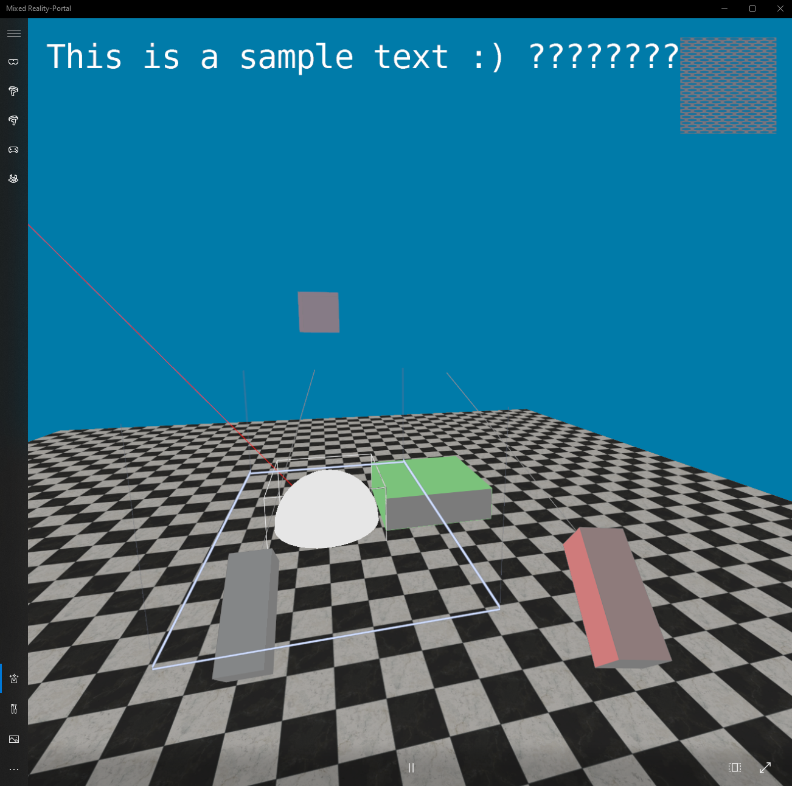

# XRe

XRe is a small toy project to build a XR engine using OpenXR and DirectX

Please note that XRe is a WIP project and mainly intended for me to learn more about OpenXR, DirectX and XR development for the moment.

## Features

Currently, XRe features a rendering loop with the possiblity to manually define models, as well as loading models from `.obj` files.
It can also render text and flat bitmaps, as well as lines. It tracks the controllers of the user and registers a `grab` action for the
controllers, rendering the grabbing controller red.

Bounding boxes are implemented as well, and a WIP version of collision detection (to make objects grabable) is also implemented.

### Screenshots

## Acknowledgements

* The textures in `data/textures` were downloaded from https://ambientcg.com/, licensed under the Creative Commons CC0 1.0 Universal License.
* XRe is using [DirectXMath](https://github.com/microsoft/DirectXMath), February 2024 version, licensed under the MIT license.
* XRe is using [DirectXTex](https://github.com/microsoft/DirectXTex), licensed under the MIT license.
