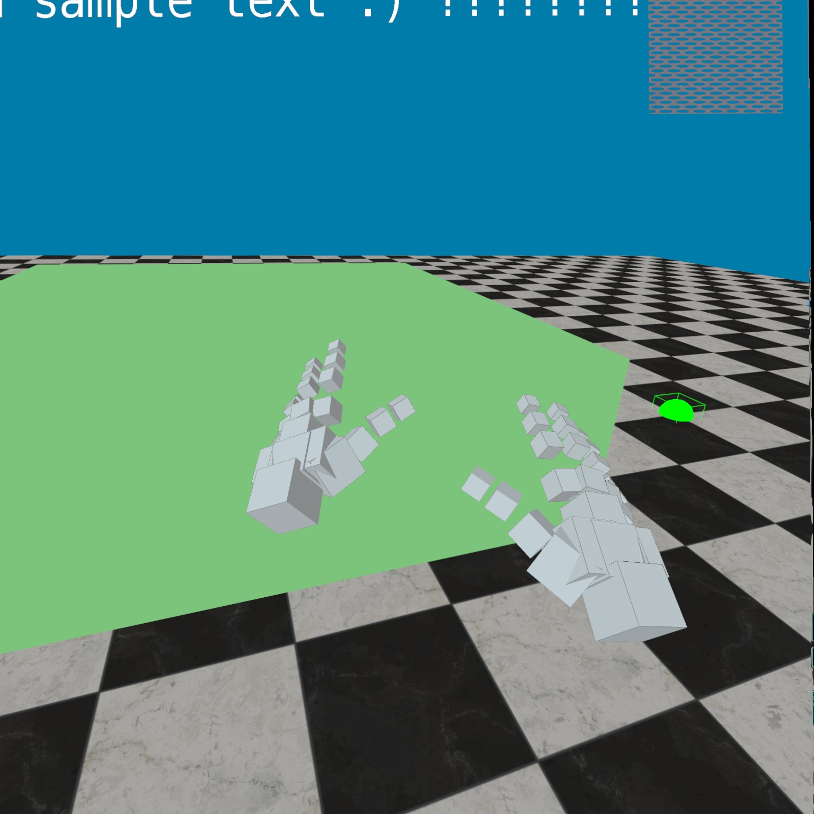

# XRe

XRe is a project to build a XR engine from scratch using OpenXR and Vulkan.

> [!WARNING]
> Please note that XRe is a WIP project and mainly intended for me to learn more about OpenXR, Vulkan and XR 
> development for the moment. It is not (yet) meant to be used for XR development directly.

> [!NOTE]
> The `main` branch contains the ongoing development using Vulkan. For the archived version using
> DirectX 11, please see the [archive_dx11 branch](https://github.com/Adrian-Hirt/XRe/tree/archive_dx11).

## Features

XRe currently has the following features:

* Full Rendering loop with separate methods to update the simulation (with predicted render time passed in) and render the scene.
* Defining models from vertices as well as loading models from `.obj` files
* Rendering text and flat bitmaps
* Rendering simple lines
* Controller tracking
  - Tracking of the `grab` action on controllers
* Ability to move / rotate objects in the scene by grabbing
* Bounding boxes for objects
* Teleporting to other locations in the scene
* Tracking the aim of the user and highlighting intersections of the aim and the scene.
* Various shaders (e.g. ambient lighting, textured models)
* Basic hand tracking

### Screenshots

Simple scene:

Hand tracking:

## Hints

When setting up a new machine to work on XRe, you need to have the OpenXR Loader in your path.
For Windows, the file is in `bin/openxr_loader.dll`, which you need to add to your `PATH` in order
to launch the applications.

## Acknowledgements

* The textures in `data/textures` were downloaded from https://ambientcg.com/, licensed under the Creative Commons CC0 1.0 Universal License.
